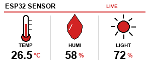

# ESP32 Sensors, MQTT, TFT & E-Paper Examples

這是一套 ESP32 課程與實作範例，涵蓋 DHT11 溫濕度、光敏電阻、OLED、ILI9225 TFT、MQTT、Wi‑Fi、LED 控制，以及微雪 2.9 吋三色電子紙。

## 目前主線成果

`40_epaper_mqtt` 是目前整合版本：電子紙顯示溫度、濕度、亮度；每 60 秒更新一次；透過 MQTT 發送感測資料，並接收三路燈號控制。



## 電子紙硬體設定

微雪 Waveshare 2.9 吋三色電子紙 V4 / Rev2.1，解析度 296×128，使用橫向畫面：

| 訊號 | ESP32 GPIO |
|---|---:|
| DIN / MOSI | 23 |
| SCK | 18 |
| CS | 27 |
| DC | 26 |
| RST | 25 |
| BUSY | 34 |
| DHT11 | 14 |
| 光敏電阻 | 33 |
| 綠色 LED | 15 |
| 黃色 LED | 2 |
| 紅色 LED | 4 |

## MQTT 設定

`40_epaper_mqtt` 預設使用：

- Broker：`mqttgo.io`
- Port：`1883`
- 感測資料：`alex/class301/data`
- 綠燈控制：`alex/class301/ctrl/gled`
- 黃燈控制：`alex/class301/ctrl/yled`
- 紅燈控制：`alex/class301/ctrl/led4`

感測資料格式：

```json
{"temp":25,"humi":60,"light":75,"dhtValid":true,"lightValid":true}
```

燈號控制格式：

```json
{"state":"on"}
```

或：

```json
{"state":"off"}
```

## 安裝與安全設定

必要函式庫位於 `libraries/`，主要包含：

- `SimpleDHT`
- `PubSubClient`
- `Adafruit-GFX-Library`
- `GxEPD2`
- 電子紙專用 `epd2in9b_V4` 驅動檔

為避免把個人憑證推送到 GitHub，程式中的 Wi‑Fi、LINE、Google Sheet、ThingSpeak 設定已改為 `YOUR_...` 佔位字串。使用前請在對應 `.ino` 中填入自己的設定；不要把真正密碼或 Token 提交回公開儲存庫。

Arduino CLI 編譯範例：

```powershell
$cli='C:\Users\user\AppData\Local\Programs\Arduino IDE\resources\app\lib\backend\resources\arduino-cli.exe'
& $cli --config-dir 'C:\Users\user\AppData\Local\Arduino15' compile --fqbn 'esp32:esp32:esp32' --libraries '.\libraries' '.\40_epaper_mqtt'
```

## 程式一覽

### 感測器與網路基礎

| 程式 | 功能說明 |
|---|---|
| `DHT11Default` | SimpleDHT 的 DHT11 基本讀值範例。 |
| `22_dht_light_oled` | DHT11 加光敏電阻，顯示於 OLED。 |
| `23_dht_light_oled_thingspeak` | 感測資料顯示於 OLED，並上傳 ThingSpeak。 |
| `24_google_dht_light_oled` | 感測資料顯示於 OLED，並寫入 Google Sheet。 |
| `25_dht_line` | DHT11/光敏電阻結合 Wi‑Fi、Google Sheet、LINE 通知、Bluetooth 與 LED 警示。 |
| `BCT33_RS485` | Wi‑Fi 與 RS485/串列感測資料通訊練習。 |
| `ESP32DHT11_TCPClient` | ESP32 DHT11 TCP Client，將資料送至 TCP Server。 |
| `WiFiClientBasic` | ESP32 連接 Wi‑Fi 的基本範例。 |
| `WifiServer_LED` | Wi‑Fi Web Server 控制 LED。 |
| `WifiServeStaticIP` | 使用固定 IP 的 Wi‑Fi Web Server/LED 範例。 |

### MQTT 與 LED 控制

| 程式 | 功能說明 |
|---|---|
| `26_mqtt` | OLED 顯示溫度、濕度、亮度與 MQTT 狀態，週期發布 JSON。 |
| `27_mott_ctrl` | MQTT 感測資料與三路 LED 控制。 |
| `33_ili_mqtt` | ILI9225 TFT 顯示感測資料與 MQTT 狀態。 |
| `34_ili_mqtt_ctrl` | ILI9225 TFT、MQTT、三路 LED 控制，並加入時間同步。 |
| `35_ili_mqtt_ctrl_page` | ILI9225 TFT 的多頁感測器/趨勢畫面、MQTT 與 LED 控制。 |
| `40_epaper_mqtt` | 目前主線：2.9 吋三色電子紙、DHT11、光敏電阻、MQTT 發送與燈號控制。 |

### ILI9225 TFT 顯示

| 程式 | 功能說明 |
|---|---|
| `28_ili9225` | ILI9225 TFT 基本初始化與顯示測試。 |
| `29_ili_color` | ILI9225 彩色繪圖與色彩測試。 |
| `30_ili_projection` | ILI9225 投影/畫面配置實驗。 |
| `31_ili_dashboard` | ILI9225 儀表板版面練習。 |
| `32_adafruit_dht_ili9225` | 使用 Adafruit DHT 類別與 ILI9225 顯示溫濕度。 |
| `33_ili9225_weather` | ILI9225 天氣/感測資訊顯示。 |
| `34_ili9225_sensor` | ILI9225 感測器頁面與資料更新。 |

### 電子紙與其他練習

| 程式 | 功能說明 |
|---|---|
| `36_EPAPER` | 2.9 吋三色電子紙的溫濕亮度儀表板，含紅底白字標題。 |
| `WATCHDOG` | ESP32 Watchdog/系統穩定性測試。 |
| `sketch_aug6b` | 課程早期 ESP32 草稿範例。 |
| `sketch_aug27a` | 課程後期 ESP32 草稿範例。 |

## 上傳紀錄

目前已驗證使用 `COM5` 上傳 ESP32，最近版本為 `40_epaper_mqtt`。完整電子紙與 MQTT 交接資訊請參考 [handoff_epaper_mqtt_20260921.md](handoff_epaper_mqtt_20260921.md)。

## 授權與第三方函式庫

本專案中的第三方函式庫各自依其原始授權條款使用；請參考各函式庫目錄內的 LICENSE/README 文件。
